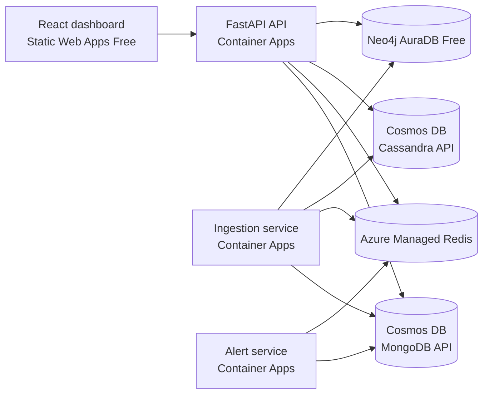

# Space Telemetry Platform

A polyglot NoSQL capstone that ingests satellite telemetry, maintains live
health, stores time-series history, models sensor dependencies, and evaluates
mission alerts. Each datastore is selected for a distinct access pattern.

## Production

- Dashboard: <https://red-pebble-048b99600.7.azurestaticapps.net>
- API: <https://space-telemetry-api.mangosea-feb17010.southindia.azurecontainerapps.io>
- Ingestion: <https://space-telemetry-ingestion.mangosea-feb17010.southindia.azurecontainerapps.io>
- Alert: <https://space-telemetry-alert.mangosea-feb17010.southindia.azurecontainerapps.io>

## Architecture



Container Apps and Redis run in South India. Cosmos DB for MongoDB and
Cassandra run in Central India because new Cosmos capacity in South India was
blocked. Static Web Apps uses its supported East Asia control-plane region and
serves the site globally. Neo4j AuraDB Free is externally managed by Neo4j.

See [docs/architecture.md](docs/architecture.md) for deployment detail.

## Services

- **API** — health, current mission health, telemetry history, alerts, and
  satellite/sensor dependency reads.
- **Ingestion** — generates telemetry and writes one packet to all four data
  models.
- **Alert** — evaluates Redis health for high temperature (`> 80°C`) and low
  battery (`< 20%`), stores alerts in MongoDB, and publishes to the Redis
  `mission-alerts` stream.
- **Frontend** — React/Vite dashboard for `SAT-001` telemetry, health, alerts,
  and dependencies.

## NoSQL models

- **MongoDB:** flexible `telemetry` and `alerts` documents in database
  `telemetry`; both collections partition by `satellite_id` and index
  `timestamp` for application sorting.
- **Redis:** expiring `satellite:{id}:health` hashes for current state and the
  bounded `mission-alerts` stream for ephemeral alert delivery.
- **Cassandra:** historical rows in `telemetry.telemetry_by_satellite`, keyed
  by `((satellite_id), timestamp, sensor_id)` with newest timestamps first.
- **Neo4j:** `(:Satellite)-[:HAS_SENSOR]->(:Sensor)` relationships for graph
  dependency and latest sensor-state queries.

## Local development

```bash
cp .env.example .env
docker compose up --build
```

Local endpoints: API `:8000`, ingestion `:8001`, alert `:8002`, and Neo4j
Browser `:7474`.

```bash
curl -X POST "http://localhost:8001/generate?satellite_id=SAT-001&count=5"
curl http://localhost:8000/health
curl http://localhost:8000/api/v1/satellites/SAT-001/telemetry
curl http://localhost:8000/api/v1/satellites/SAT-001/health
curl http://localhost:8000/api/v1/satellites/SAT-001/dependencies
curl http://localhost:8000/api/v1/alerts
```

## Deployment and CI/CD

Backend images are built for `linux/amd64`, tagged with the Git commit SHA,
and stored in Basic ACR. Container Apps use system-assigned identities with
`AcrPull` scoped only to ACR; ACR admin is disabled. Deployment authenticates
with GitHub OIDC, updates all three apps, deploys Vite, and checks API health.

Required GitHub secrets contain only OIDC identifiers: `AZURE_CLIENT_ID`,
`AZURE_TENANT_ID`, and `AZURE_SUBSCRIPTION_ID`. Production datastore
credentials remain Container App secrets and are not stored in GitHub or
Terraform.

## Monitoring and security

Container Apps send console logs to the existing 30-day Log Analytics
workspace. Revision health, replica state, and `/health` endpoints provide
low-cost operational checks. No additional billable monitoring resource is
enabled for this demo.

All public endpoints use HTTPS. Redis and Cassandra require TLS; Aura uses
`neo4j+s://`; credentials are secret references. Production CORS is restricted
to the deployed dashboard and local Vite origins.

## Cost choices

- Cosmos MongoDB: free tier, shared 400 RU/s.
- Cosmos Cassandra: serverless, pay per request.
- Azure Managed Redis: smallest `Balanced_B0`, one node, no HA/persistence.
- Neo4j AuraDB and Static Web Apps: Free.
- Container Apps: 0.25 CPU/0.5 GiB, max one replica, scale to zero.
- ACR: Basic; Log Analytics reuses the environment workspace.

## Verification

```bash
pytest -q
python -m compileall services/api/app
python -m compileall services/ingestion/app
python -m compileall services/alert/app
docker compose config -q
(cd frontend && npm run build)
(cd infrastructure/terraform && terraform fmt -check && terraform validate)
git diff --check
```

Never commit `.env`, Terraform state, credentials, connection strings, access
keys, deployment tokens, or downloaded Aura credential files.
