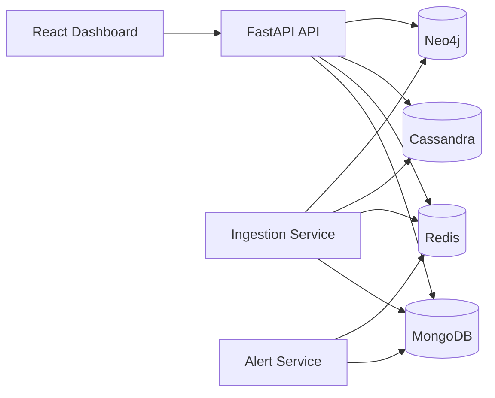

# Space Telemetry Platform

This is a cloud-based satellite telemetry project built for the NoSQL Cloud Datastore capstone.

The system creates sample satellite sensor data, stores it in different NoSQL databases, checks satellite health, creates alerts, and shows the information on a web dashboard.

## Live Project

- Dashboard: <https://red-pebble-048b99600.7.azurestaticapps.net>
- API: <https://space-telemetry-api.mangosea-feb17010.southindia.azurecontainerapps.io>
- Ingestion Service: <https://space-telemetry-ingestion.mangosea-feb17010.southindia.azurecontainerapps.io>
- Alert Service: <https://space-telemetry-alert.mangosea-feb17010.southindia.azurecontainerapps.io>

## Architecture



The backend services run on Azure Container Apps. The frontend is hosted on Azure Static Web Apps.

MongoDB and Cassandra use Azure Cosmos DB. Redis uses Azure Managed Redis. Neo4j uses Neo4j AuraDB Free.

## Main Services

- **API** - Gives telemetry, health, alerts, and sensor relationship data to the frontend.
- **Ingestion** - Creates sample satellite telemetry and saves it to the databases.
- **Alert** - Checks satellite health and creates alerts when values are unsafe.
- **Frontend** - Shows satellite information on a React dashboard.

## Why Four NoSQL Databases?

This project uses different databases for different types of data.

- **MongoDB** - Stores telemetry records and alerts as documents.
- **Redis** - Stores the latest satellite health data for fast access.
- **Cassandra** - Stores historical telemetry and time-series data.
- **Neo4j** - Stores relationships between satellites and sensors.

This approach allows each database to do the job it is best suited for.

## Alert Rules

The system currently checks two important conditions:

- High temperature: above **80°C**
- Low battery: below **20%**

When these conditions happen, the alert service creates an alert for the mission-control dashboard.

## Run Locally

First create the local environment file:

```bash
cp .env.example .env
```

Start the Docker services:

```bash
docker compose up --build
```

Local services:

- API: `http://localhost:8000`
- Ingestion: `http://localhost:8001`
- Alert: `http://localhost:8002`
- Neo4j Browser: `http://localhost:7474`

Generate sample telemetry:

```bash
curl -X POST "http://localhost:8001/generate?satellite_id=SAT-001&count=5"
```

Check the API health:

```bash
curl http://localhost:8000/health
```

To run the frontend:

```bash
cd frontend
npm install
npm run dev
```

Then open the local Vite URL shown in the terminal, normally `http://localhost:5173`.

## Azure Deployment

The production backend is deployed using Azure Container Apps.

Docker images are stored in Azure Container Registry. The frontend is deployed using Azure Static Web Apps.

The three backend services are:

- `space-telemetry-api`
- `space-telemetry-ingestion`
- `space-telemetry-alert`

The project uses small and low-cost cloud resources because it is a capstone/demo project.

## CI/CD

GitHub Actions automatically tests and deploys the project.

The deployment process:

1. Runs tests.
2. Builds the frontend.
3. Logs in to Azure using OIDC.
4. Builds Linux/AMD64 Docker images.
5. Pushes the images to Azure Container Registry.
6. Updates the Azure Container Apps.
7. Deploys the frontend.
8. Checks the production API health.

OIDC is used so a permanent Azure client secret is not required in GitHub.

## Security

- Credentials are not stored in the source code.
- Sensitive values use Azure Container App secrets.
- Public production endpoints use HTTPS.
- Database connections use secure connections.
- Azure Container Registry admin access is disabled.
- Container Apps use managed identities.
- CORS only allows the production frontend and approved local development addresses.

## Monitoring

Azure Container Apps logs are sent to Log Analytics.

We can use Azure to check:

- Application logs
- Container App revisions
- Replica health
- API health

The `/health` endpoint also checks whether MongoDB, Redis, Cassandra, and Neo4j are connected.

A healthy production response looks like this:

```json
{
  "status": "ok",
  "checks": {
    "mongodb": "ok",
    "redis": "ok",
    "cassandra": "ok",
    "neo4j": "ok"
  }
}
```

## Infrastructure as Code

Terraform files are available in:

```text
infrastructure/terraform/
```

They describe the main Azure infrastructure used by this project.

## Testing

Useful verification commands:

```bash
pytest -q
python -m compileall services/api/app
python -m compileall services/ingestion/app
python -m compileall services/alert/app
docker compose config -q
(cd frontend && npm run build)
(cd infrastructure/terraform && terraform fmt -check && terraform validate)
git diff --check
```

## Technologies Used

- Python
- FastAPI
- React
- Vite
- Docker
- MongoDB
- Redis
- Cassandra
- Neo4j
- Microsoft Azure
- Terraform
- GitHub Actions

## Project Summary

This project shows how different NoSQL databases can work together in one cloud application.

Satellite telemetry is generated by the ingestion service. The data is stored in MongoDB, Redis, Cassandra, and Neo4j based on its purpose. The API reads the information and sends it to the dashboard. The alert service checks important satellite values and creates alerts when there is a problem.

The complete application can run locally with Docker and is also deployed to Azure.

> Important: Never commit `.env` files, passwords, database connection strings, access keys, Terraform state files, or downloaded credential files to GitHub.
