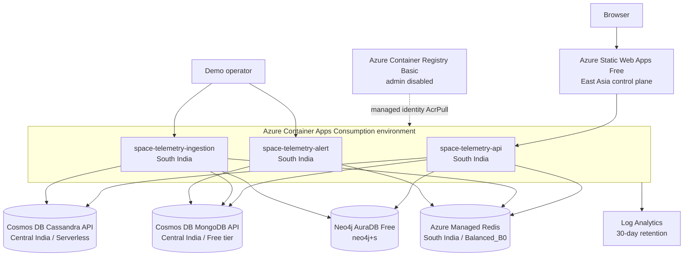

# Architecture

## Production topology

## Data flow

1. Ingestion generates a satellite packet.
2. MongoDB stores the complete flexible telemetry document.
3. Redis replaces the satellite's current health hash with a one-hour TTL.
4. Cassandra appends a historical row partitioned by satellite and clustered
   newest-first by timestamp and sensor.
5. Neo4j merges the Satellite, Sensor, and `HAS_SENSOR` relationship.
6. Alert reads Redis health. Triggered conditions become MongoDB alert
   documents and Redis stream entries.
7. API combines the read models for the React dashboard.

## Regional decisions

Compute and Redis are in South India. Azure rejected new Cosmos DB reservations
there because of regional demand, so MongoDB and Cassandra use Central India.
Both remain single-region. Cassandra uses serverless billing because the
subscription's one Cosmos free-tier account is already assigned to MongoDB.

## Reliability and cost

This capstone favors minimum cost over production HA: Container Apps scale to
zero with one maximum replica, Redis uses one B0 node without persistence or
geo-replication, and AuraDB uses its Free plan. MongoDB and Cassandra are
single-region managed services.

## Security boundaries

- Per-app system identities receive only ACR-scoped `AcrPull`; ACR admin is
  disabled.
- Datastore credentials are Container App secrets referenced by environment
  variables.
- Redis and Cassandra require TLS 1.2 or newer. Cassandra uses CA and explicit
  SNI hostname verification. Neo4j uses `neo4j+s://`.
- HTTPS is enforced by Azure ingress and Static Web Apps.
- CORS permits the production frontend and local Vite origins only.
- GitHub Actions uses Azure OIDC rather than a client secret.
- Terraform excludes secret-bearing datastore resources until a reviewed
  import strategy is available.
